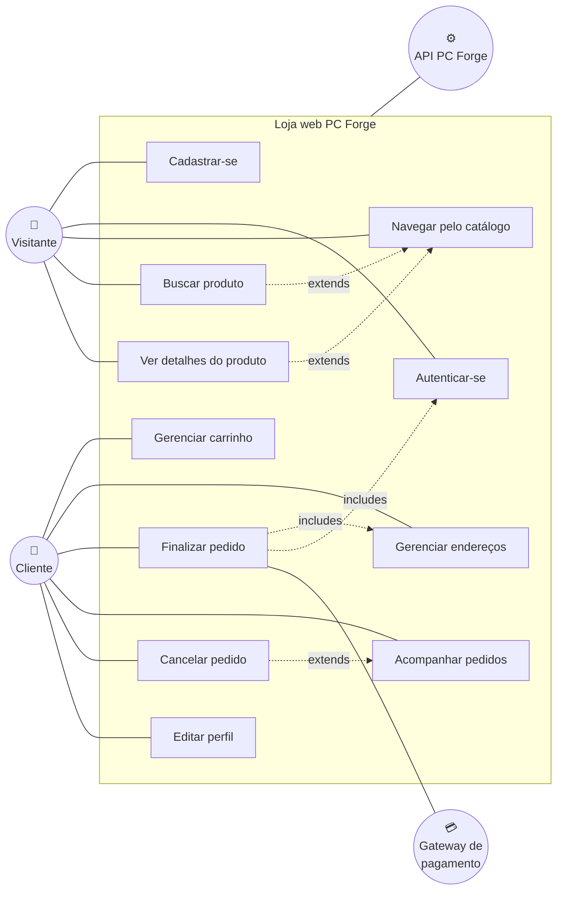
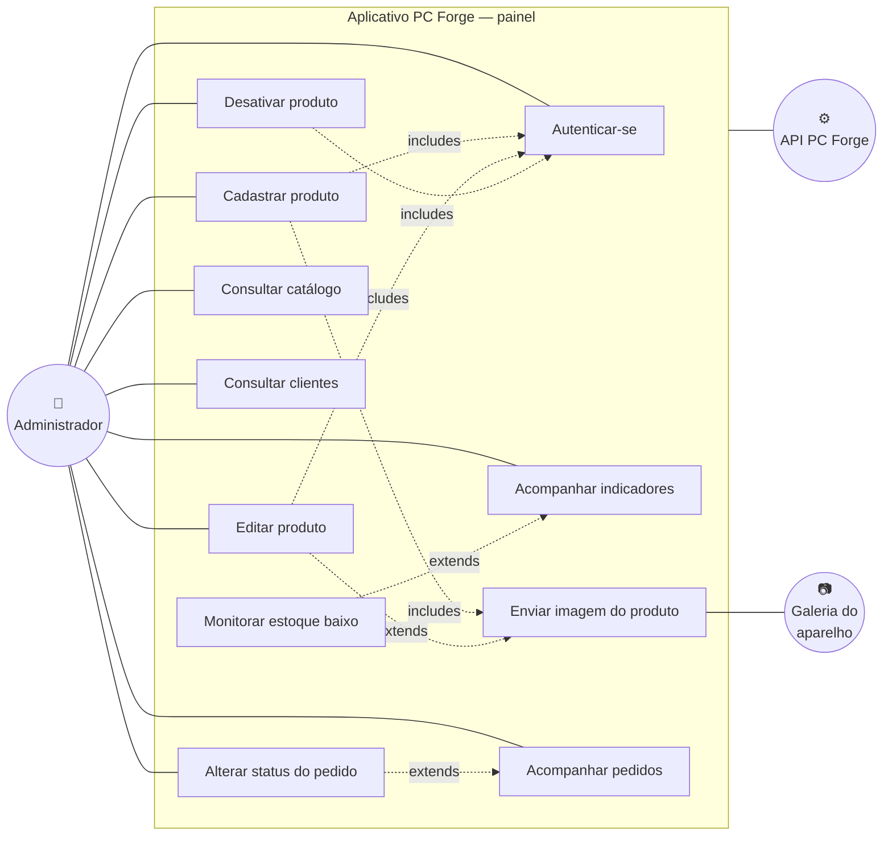

# Diagramas de caso de uso

Os dois recortes que separam as personas do PC Forge — e, com elas, as duas plataformas: o
cliente compra **na loja web**, o administrador opera a loja **pelo aplicativo**. Requisitos
referenciados em [requisitos.md](requisitos.md).

---

## Caso de uso 1 — Cliente compra na loja web

### Detalhamento — UC08 · Finalizar pedido

| | |
|---|---|
| **Ator principal** | Cliente autenticado |
| **Plataforma** | Loja web |
| **Pré-condições** | Carrinho com ao menos um item; ao menos um endereço cadastrado |
| **Pós-condições** | Pedido criado com status `pendente`, preço congelado e estoque debitado |
| **Requisitos** | RF-04.1 a RF-04.4 |

**Fluxo principal**

1. O cliente abre o carrinho e revisa os itens
2. O sistema apresenta o total e pede a escolha do endereço de entrega
3. O cliente seleciona um endereço e confirma
4. O sistema valida a permissão `pedido:criar` do cliente
5. O sistema soma as quantidades por produto e valida o estoque
6. O sistema cria o pedido e os itens e debita o estoque, em uma única transação
7. O sistema apresenta a confirmação e esvazia o carrinho

**Fluxos alternativos**

- **5a. Estoque insuficiente** — o sistema responde **409** nomeando o produto e a quantidade
  disponível, e mantém o carrinho para ajuste
- **2a. Sem endereço cadastrado** — o sistema desvia para o cadastro de endereço (UC07) e
  retorna ao passo 2
- **3a. Endereço de outro cliente** — o sistema responde **403**
- **1a. Sessão expirada** — o token venceu; o sistema leva ao login (UC02) e retorna
- **6a. Falha no meio da transação** — nada é gravado: sem pedido, sem itens e sem estoque
  debitado

---

## Caso de uso 2 — Administrador opera a loja pelo aplicativo

> **O aplicativo é exclusivamente administrativo.** O login recusa quem não tem o papel
> `admin` antes de gravar a sessão; não existe jornada de compra no app.

### Detalhamento — UC22 · Cadastrar produto

| | |
|---|---|
| **Ator principal** | Administrador |
| **Plataforma** | Aplicativo (também disponível na web) |
| **Pré-condições** | Autenticado com papel `admin`; a categoria desejada já existe |
| **Pós-condições** | Produto ativo no catálogo, visível na loja web |
| **Requisitos** | RF-02.5, RF-03.1 a RF-03.4 |

**Fluxo principal**

1. O administrador abre o formulário de novo produto
2. Preenche nome, descrição, preço, estoque e escolhe a categoria
3. Seleciona uma imagem da galeria do aparelho
4. O sistema valida a imagem (extensão, tipo MIME e tamanho) e a armazena com nome gerado
5. O administrador confirma; o sistema valida preço e estoque
6. O sistema cria o produto associado à URL da imagem
7. O produto passa a aparecer na vitrine da loja web

**Fluxos alternativos**

- **4a. Extensão ou tipo MIME não permitido** — **400**, e o formulário continua preenchido
- **4b. Arquivo acima de 5 MB** — **413**
- **5a. Preço zero ou negativo, ou estoque negativo** — o formulário sinaliza no campo e não
  chega a chamar a API
- **3a. Sem imagem** — o produto é criado sem foto e a vitrine exibe a imagem padrão
- **1a. Usuário sem papel `admin`** — não alcança este ponto: o login já recusou

### Detalhamento — UC29 · Alterar status do pedido

| | |
|---|---|
| **Ator principal** | Administrador |
| **Plataforma** | Aplicativo |
| **Pré-condições** | Autenticado com papel `admin`; o pedido não está em estado final |
| **Pós-condições** | Pedido no novo status; `data_pagamento` preenchida ao virar `pago` |
| **Requisitos** | RF-06.5 |

**Fluxo principal**

1. O administrador abre a lista de pedidos e escolhe um
2. O sistema exibe itens, cliente, endereço e o status atual
3. O sistema oferece **apenas as transições válidas** a partir do estado atual
4. O administrador escolhe o novo status
5. A API revalida a transição e grava
6. A tela recarrega já no novo status

**Fluxos alternativos**

- **3a. Pedido `entregue` ou `cancelado`** — estados finais: nenhuma transição é oferecida
- **5a. Transição inválida** — **409**; só ocorre se o pedido mudou por outra via desde que a
  tela abriu

---

## Atores

| Ator | Descrição |
|---|---|
| **Visitante** | Navega pelo catálogo da web sem estar autenticado. Não cria pedido |
| **Cliente** | Visitante autenticado. Compra, gerencia endereços e acompanha pedidos, **na web** |
| **Administrador** | Cliente com o papel `admin`. Opera catálogo, pedidos e indicadores, **pelo app** |
| **API PC Forge** | Ator de sistema. Concentra regra de negócio, autenticação e autorização |
| **Gateway de pagamento** | Ator externo (Mercado Pago). Processa o pagamento do pedido |
| **Galeria do aparelho** | Fonte das imagens de produto enviadas pelo app |
