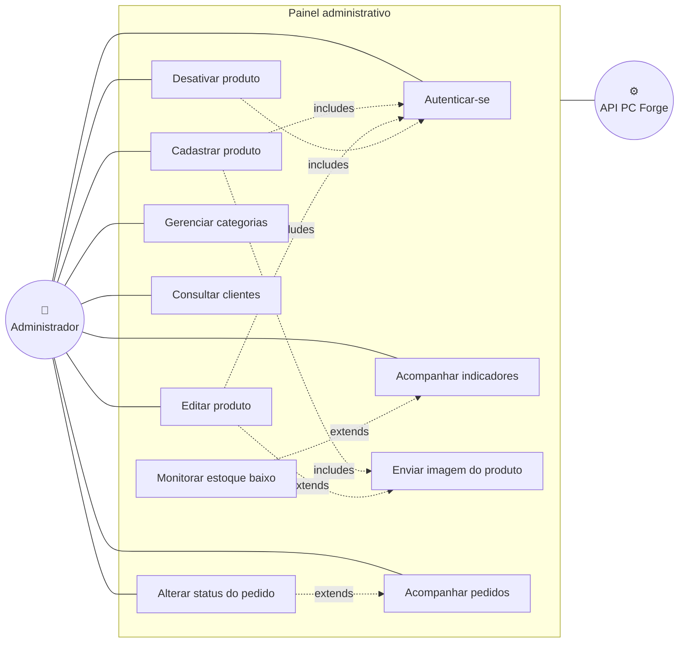

# Diagramas de caso de uso

Os dois recortes que separam as personas do PC Forge: o cliente comprando pelo app e o
administrador operando a loja pela web. Requisitos referenciados em
[requisitos.md](requisitos.md).

---

## Caso de uso 1 — Cliente compra pelo aplicativo

### Detalhamento — UC08 · Finalizar pedido

| | |
|---|---|
| **Ator principal** | Cliente autenticado |
| **Pré-condições** | Carrinho com ao menos um item; ao menos um endereço cadastrado |
| **Pós-condições** | Pedido criado com status inicial e itens com o preço vigente registrado |
| **Requisitos** | RF-04.1, RF-04.2, RF-04.3 |

**Fluxo principal**

1. O cliente abre o carrinho e revisa os itens
2. O sistema apresenta o total e pede a escolha do endereço de entrega
3. O cliente seleciona um endereço e confirma
4. O sistema valida estoque de cada item
5. O sistema cria o pedido e os itens, congelando o preço unitário
6. O sistema apresenta a confirmação e esvazia o carrinho

**Fluxos alternativos**

- **4a. Estoque insuficiente** — o sistema identifica o item, informa a quantidade disponível
  e mantém o carrinho para ajuste
- **2a. Sem endereço cadastrado** — o sistema desvia para o cadastro de endereço (UC07) e
  retorna ao passo 2
- **1a. Sessão expirada** — o token venceu; o sistema leva ao login (UC02) e retorna

---

## Caso de uso 2 — Administrador gerencia a loja

> **Onde cada caso acontece.** UC22, UC23, UC24, UC25 e UC26 — tudo que **escreve** no
> catálogo — existem só na web. O app mobile expõe ao admin UC21, UC30, UC28 e as consultas
> somente leitura de produtos e clientes.

### Detalhamento — UC22 · Cadastrar produto

| | |
|---|---|
| **Ator principal** | Administrador |
| **Pré-condições** | Autenticado com papel `admin`; a categoria desejada já existe |
| **Pós-condições** | Produto ativo no catálogo, visível na vitrine |
| **Requisitos** | RF-02.5, RF-03.1, RF-03.2, RF-03.3, RF-03.4 |

**Fluxo principal**

1. O administrador abre o formulário de novo produto
2. Preenche nome, descrição, valor, estoque e categoria
3. Seleciona uma imagem
4. O sistema valida a imagem (extensão, tipo MIME e tamanho) e a armazena com nome gerado
5. O sistema cria o produto associado à URL da imagem
6. O produto passa a aparecer na vitrine

**Fluxos alternativos**

- **4a. Extensão ou tipo MIME não permitido** — o sistema recusa com **400** e o produto não
  é criado
- **4b. Arquivo acima de 5 MB** — o sistema recusa com **413**
- **3a. Sem imagem** — o produto é criado sem foto e a vitrine exibe a imagem padrão
- **1a. Usuário sem papel `admin`** — o `authorizeRole` responde **403** e o formulário nem
  chega a ser submetido, porque a interface já não oferece a opção

---

## Atores

| Ator | Descrição |
|---|---|
| **Visitante** | Navega pelo catálogo sem estar autenticado. Não cria pedido |
| **Cliente** | Visitante autenticado. Compra, gerencia endereços e acompanha pedidos |
| **Administrador** | Cliente com o papel `admin`. Opera catálogo, pedidos e indicadores |
| **API PC Forge** | Ator de sistema. Concentra regra de negócio, autenticação e autorização |
| **Gateway de pagamento** | Ator externo (Mercado Pago). Processa o pagamento do pedido |
