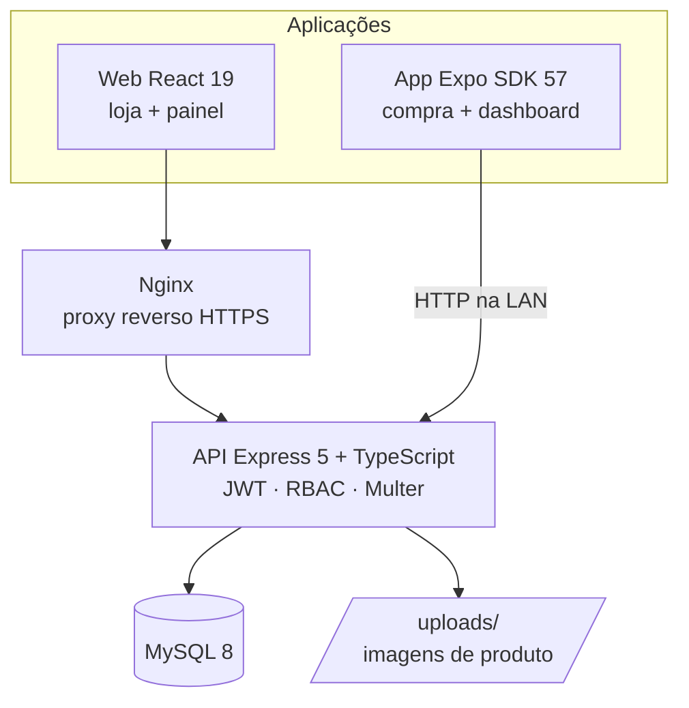

# Contextualização e evolução do produto

## O problema

Montar ou atualizar um PC obriga o comprador a decidir em várias categorias ao mesmo tempo —
processador, placa de vídeo, memória, armazenamento, fonte, gabinete, periféricos — e cada
decisão depende das outras. Em marketplaces generalistas esse comprador enfrenta três
atritos concretos:

- **Catálogo indiferenciado.** Componentes aparecem misturados a produtos de outras áreas,
  sem a organização por categoria que a montagem exige.
- **Disponibilidade opaca.** O estoque só aparece no fim do fluxo, quando o item já entrou no
  carrinho, e a compra falha tarde.
- **Vitrine sem operação.** A loja mostra o produto, mas quem opera não tem onde acompanhar
  faturamento, pedidos por status e itens perto de acabar.

O **PC Forge** é um e-commerce especializado em componentes de PC que ataca esses três
pontos: catálogo organizado por categoria, estoque visível na vitrine e um painel
administrativo com os indicadores da operação.

> Projeto acadêmico, desenvolvido em dupla. O escopo é demonstrar a stack completa —
> API, banco, web, mobile e containers — não operar comercialmente.

## Personas

### Cliente — compra pelo app

Quem está montando ou atualizando um PC. Navega pelo catálogo, filtra por categoria, confere
preço e estoque antes de decidir, cadastra o endereço de entrega e acompanha os próprios
pedidos. Não deve enxergar nada da operação da loja.

O que ele precisa: **ver o estoque antes de decidir** e **não perder o carrinho** ao trocar
de tela.

### Administrador — opera a loja

Quem cuida do catálogo e atende os pedidos. Cadastra produtos com imagem, ajusta preço e
estoque, muda o status dos pedidos e acompanha os indicadores do negócio.

O que ele precisa: **saber o que está acabando** antes de o cliente descobrir, e um lugar
único para o estado da operação.

A separação entre as duas personas não é cosmética: é o **controle de acesso**, aplicado em
três camadas independentes e documentado em [rbac.md](rbac.md).

## Evolução do produto

### Etapa 1 — a loja web

O produto nasceu como **duas aplicações sobre uma API**: uma vitrine React e um painel
administrativo, ambos em `TechAcademy5front/`, falando com uma API Express + Sequelize +
MySQL em `TechAcademy5back/`. Aqui entraram o catálogo, o carrinho, o cadastro de clientes,
os pedidos e a autenticação por JWT.

### Etapa 2 — upload de imagens e endurecimento da API

O catálogo passou a aceitar **imagem de produto** via Multer, com validação de extensão,
tipo MIME e tamanho, e nomes gerados no servidor para evitar colisão. A API ganhou CORS e
passou a ser publicada na rede local. O ambiente web ganhou HTTPS por trás de um proxy
Nginx.

### Etapa 3 — o aplicativo mobile

A jornada de compra ganhou um **app nativo em Expo + Expo Router** (`TechAcademy5mobile/`),
consumindo **a mesma API**, sem backend próprio nem duplicação de regra de negócio. A divisão
de responsabilidade entre plataformas ficou assim:

| | Loja web | Aplicativo |
|---|---|---|
| Vitrine, carrinho e checkout | ✅ | ✅ |
| Cadastro de cliente e endereços | ✅ | ✅ |
| CRUD de produtos e upload de imagem | ✅ | ✅ (foto da galeria) |
| Gestão de pedidos e status | ✅ | ✅ |
| Indicadores e estoque baixo | ✅ | ✅ |
| CRUD de categorias | ✅ | ❌ |

As duas plataformas atendem as duas personas. O que justifica o app não é ter algo
exclusivo, e sim **onde a pessoa está**: o cliente decide no ônibus, e o estoque acaba no
depósito, não na mesa do escritório.

O app descobre o endereço da API pelo host do dev server do Expo, o que permite rodar na
máquina de qualquer integrante da dupla sem editar arquivo.

### Etapa 4 — autorização por papéis

O controle de acesso deixou de ser um booleano `admin` na tabela de clientes e virou **RBAC**
com `role`, `permissao` e as duas tabelas de junção, mais o middleware `authorizeRole([...])`
como função de ordem superior. Detalhes em [rbac.md](rbac.md).

### Etapa 5 — regra de estoque e permissões granulares

Uma auditoria encontrou o buraco central: o estoque era **validado e nunca debitado**, então
um produto com uma unidade podia ser vendido infinitas vezes. A baixa entrou na transação que
já criava pedido e itens, e o cancelamento passou a devolver. O status do pedido ganhou uma
máquina de estados, e `authorizePermission` passou a valer nas rotas que o cliente exerce —
o que fez as tabelas `permissao` e `role_permissao` sustentarem decisão de verdade.

### Etapa 6 — o app também no navegador

Com `react-native-web`, o mesmo código do app passou a rodar como página. Isso dá uma segunda
plataforma de demonstração sem manter um segundo projeto — ao custo de a sessão precisar de
dois back-ends de armazenamento (`SecureStore` no nativo, `localStorage` no navegador).

## Arquitetura hoje

Tudo sobe com um `docker compose up`: MySQL, backend, frontend e Nginx. O
[seed](../TechAcademy5back/src/scripts/seed.ts) é idempotente e popula papéis, permissões,
as duas contas de demonstração e o catálogo.

## Por que monorepo

As três aplicações e a infraestrutura vivem no mesmo repositório. Isso mantém
`docker-compose.yml`, `.env` e CI em um lugar só, garante que uma mudança de contrato da API
apareça no mesmo commit que ajusta os consumidores, e preserva a evolução acima no histórico —
o mobile não é um projeto novo, é uma etapa deste.
