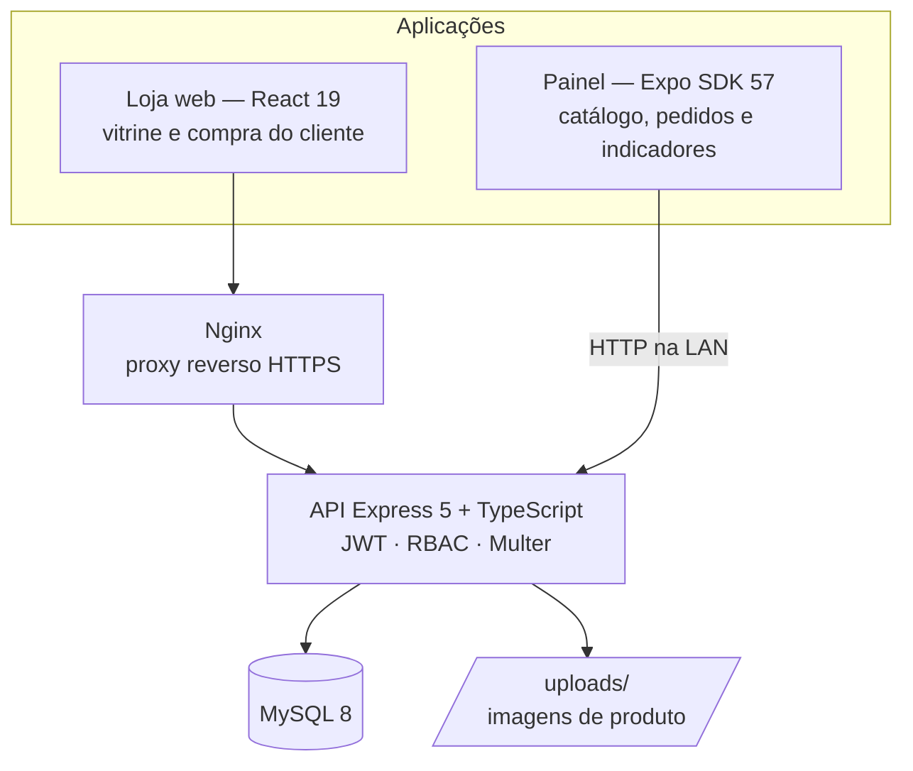

# Contextualização e evolução do produto

## O problema

Montar ou atualizar um PC obriga o comprador a decidir em várias categorias ao mesmo tempo —
processador, placa de vídeo, memória, armazenamento, fonte, gabinete, periféricos — e cada
decisão depende das outras. Em marketplaces generalistas esse comprador enfrenta três
atritos concretos:

- **Catálogo indiferenciado.** Componentes aparecem misturados a produtos de outras áreas,
  sem a organização por categoria que a montagem exige.
- **Disponibilidade opaca.** O estoque só aparece no fim do fluxo, quando o item já entrou no
  carrinho, e a compra falha tarde.
- **Vitrine sem operação.** A loja mostra o produto, mas quem opera não tem onde acompanhar
  faturamento, pedidos por status e itens perto de acabar.

O **PC Forge** é um e-commerce especializado em componentes de PC que ataca esses três
pontos: catálogo organizado por categoria, estoque visível na vitrine e um painel
administrativo com os indicadores da operação.

> Projeto acadêmico, desenvolvido em dupla. O escopo é demonstrar a stack completa —
> API, banco, web, mobile e containers — não operar comercialmente.

## Personas

### Cliente — compra na loja web

Quem está montando ou atualizando um PC. Navega pelo catálogo, filtra por categoria, confere
preço e estoque antes de decidir, cadastra o endereço de entrega e acompanha os próprios
pedidos. Não deve enxergar nada da operação da loja.

O que ele precisa: **ver o estoque antes de decidir** e **não perder o carrinho** ao trocar
de tela. Ele nunca abre o aplicativo — para ele, o PC Forge é o site.

### Administrador — opera a loja pelo aplicativo

Quem cuida do catálogo e atende os pedidos. Cadastra produtos com imagem tirada do próprio
aparelho, ajusta preço e estoque, muda o status dos pedidos e acompanha os indicadores do
negócio.

O que ele precisa: **saber o que está acabando** antes de o cliente descobrir, um lugar único
para o estado da operação e **poder resolver isso de onde estiver** — o estoque acaba no
depósito, não na mesa do escritório. É essa mobilidade que justifica o app existir.

A separação entre as duas personas não é cosmética: **cada uma tem a sua plataforma**. A web
é a loja; o aplicativo é o painel, e recusa quem não é administrador já no login. Por trás das
duas, o mesmo **controle de acesso** em três camadas independentes, documentado em
[rbac.md](rbac.md).

| | Cliente | Administrador |
|---|---|---|
| Onde | Loja web | Aplicativo (e a web) |
| Faz | Compra, endereços, próprios pedidos | Catálogo, pedidos, indicadores |
| Papel | `cliente` | `admin` |

## Evolução do produto

### Etapa 1 — a loja web

O produto nasceu como **duas aplicações sobre uma API**: uma vitrine React e um painel
administrativo, ambos em `TechAcademy5front/`, falando com uma API Express + Sequelize +
MySQL em `TechAcademy5back/`. Aqui entraram o catálogo, o carrinho, o cadastro de clientes,
os pedidos e a autenticação por JWT.

### Etapa 2 — upload de imagens e endurecimento da API

O catálogo passou a aceitar **imagem de produto** via Multer, com validação de extensão,
tipo MIME e tamanho, e nomes gerados no servidor para evitar colisão. A API ganhou CORS e
passou a ser publicada na rede local. O ambiente web ganhou HTTPS por trás de um proxy
Nginx.

### Etapa 3 — o aplicativo mobile

Chegou um **app em Expo + Expo Router** (`TechAcademy5mobile/`), consumindo **a mesma API**,
sem backend próprio nem duplicação de regra de negócio. Nasceu cobrindo a jornada de compra,
espelhando a web.

O app descobre o endereço da API pelo host do dev server do Expo, o que permite rodar na
máquina de qualquer integrante da dupla sem editar arquivo.

### Etapa 4 — autorização por papéis

O controle de acesso deixou de ser um booleano `admin` na tabela de clientes e virou **RBAC**
com `role`, `permissao` e as duas tabelas de junção, mais o middleware `authorizeRole([...])`
como função de ordem superior. Detalhes em [rbac.md](rbac.md).

### Etapa 5 — o app também no navegador

Com `react-native-web`, o mesmo código do app passou a rodar como página. Isso dá uma segunda
plataforma de demonstração sem manter um segundo projeto — ao custo de a sessão precisar de
dois back-ends de armazenamento (`SecureStore` no nativo, `localStorage` no navegador).

### Etapa 6 — o app vira o painel administrativo

Duplicar a jornada de compra em duas plataformas gerava o mesmo trabalho duas vezes e não
resolvia o problema real de quem **opera** a loja: estar longe do computador. O aplicativo
passou a ser **exclusivamente administrativo** — saíram cadastro, vitrine, perfil e endereços;
entraram o CRUD de produtos com upload de imagem pela galeria do aparelho e a gestão de
pedidos com máquina de estados.

A divisão de responsabilidade entre plataformas ficou assim:

| | Loja web | Aplicativo |
|---|---|---|
| Vitrine e compra do cliente | ✅ | ❌ |
| Cadastro de cliente e endereços | ✅ | ❌ |
| CRUD de produtos | ✅ | ✅ |
| Upload de imagem de produto | ✅ | ✅ (galeria do aparelho) |
| Gestão de pedidos e status | ✅ | ✅ |
| Indicadores e estoque baixo | ✅ | ✅ |

Cada plataforma atende **uma** persona, e nenhuma regra de negócio vive em duas.

## Arquitetura hoje

Tudo sobe com um `docker compose up`: MySQL, backend, frontend e Nginx. O
[seed](../TechAcademy5back/src/scripts/seed.ts) é idempotente e popula papéis, permissões,
as duas contas de demonstração e o catálogo.

## Por que monorepo

As três aplicações e a infraestrutura vivem no mesmo repositório. Isso mantém
`docker-compose.yml`, `.env` e CI em um lugar só, garante que uma mudança de contrato da API
apareça no mesmo commit que ajusta os consumidores, e preserva a evolução acima no histórico —
o mobile não é um projeto novo, é uma etapa deste.
