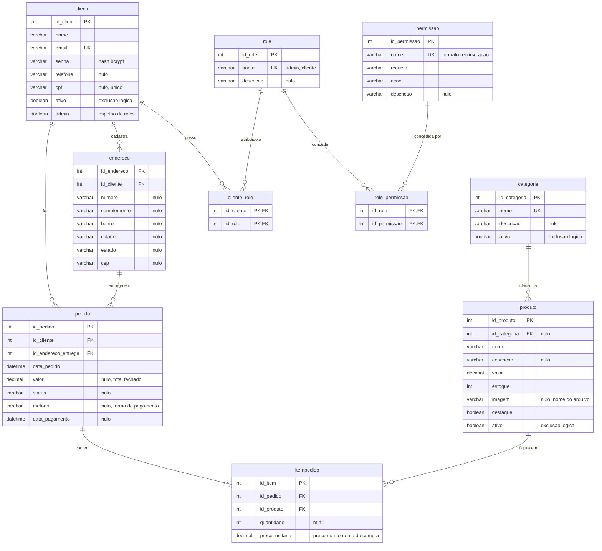

# Diagrama entidade-relacionamento

Modelo físico do PC Forge: **10 tabelas**, sendo 6 do domínio da loja e 4 do controle de
acesso. Foi extraído dos models Sequelize em
[TechAcademy5back/src/models/](../TechAcademy5back/src/models/), que são a fonte de verdade —
o schema é criado por `sequelize.sync()`, sem migrations.

## Diagrama

## Decisões de modelagem

**`itempedido.preco_unitario` é redundante de propósito.** O preço fica congelado no momento
da compra. Sem essa coluna, mudar o valor de um produto reescreveria retroativamente o total
de todos os pedidos antigos — o histórico deixaria de bater com o que o cliente pagou.

**Exclusão lógica em `cliente`, `produto` e `categoria`.** A coluna `ativo` desativa em vez de
apagar. Um produto que já figura em `itempedido` não pode sumir sem quebrar o pedido, e um
cliente desativado precisa manter o histórico. Por isso `DELETE /produtos/:id` chama
`desativarProduto`, não um `destroy`.

**`pedido` referencia o endereço, não o copia.** `id_endereco_entrega` é FK para `endereco`,
que por sua vez pertence a um `cliente`. É a razão de o checkout exigir endereço cadastrado
antes de criar o pedido.

**As duas junções do RBAC usam chave primária composta.** Em `cliente_role` e
`role_permissao` o par de FKs é a PK, então a restrição de não duplicar um vínculo mora no
banco, não na lógica do seed.

**`cliente.admin` convive com o RBAC.** É espelho de `roles.includes("admin")`, mantido
porque web e mobile leem esse campo. Está previsto remover quando as duas pontas passarem a
ler `roles` — ver a pendência em [rbac.md](rbac.md).

**`endereco` não tem logradouro.** O model traz número, complemento, bairro, cidade, estado e
CEP, herdados do schema original da loja web. É uma lacuna conhecida do modelo, não um
recorte deste documento.

## Cardinalidades

| Relação | Cardinalidade | Leitura |
|---|---|---|
| `cliente` → `endereco` | 1:N | um cliente cadastra vários endereços |
| `cliente` → `pedido` | 1:N | um cliente faz vários pedidos |
| `endereco` → `pedido` | 1:N | um endereço recebe vários pedidos |
| `pedido` → `itempedido` | 1:N (mínimo 1) | um pedido contém ao menos um item |
| `produto` → `itempedido` | 1:N | um produto figura em vários pedidos |
| `categoria` → `produto` | 1:N | uma categoria classifica vários produtos |
| `cliente` ↔ `role` | N:N via `cliente_role` | um cliente tem vários papéis |
| `role` ↔ `permissao` | N:N via `role_permissao` | um papel concede várias permissões |
