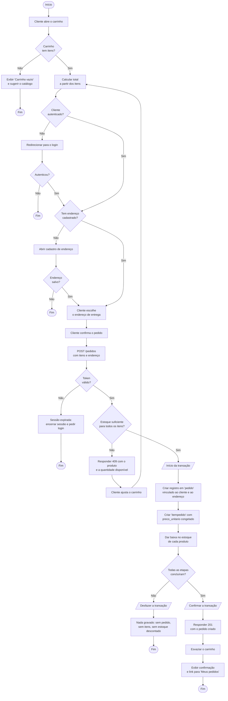
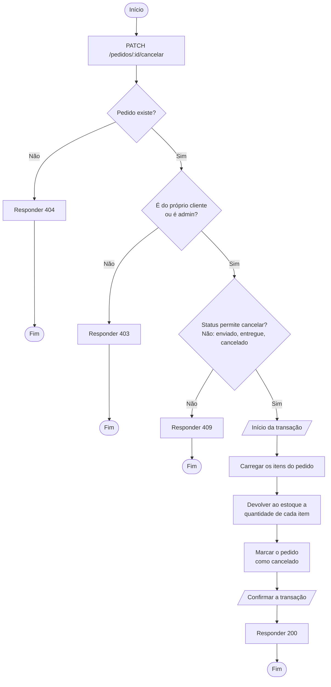
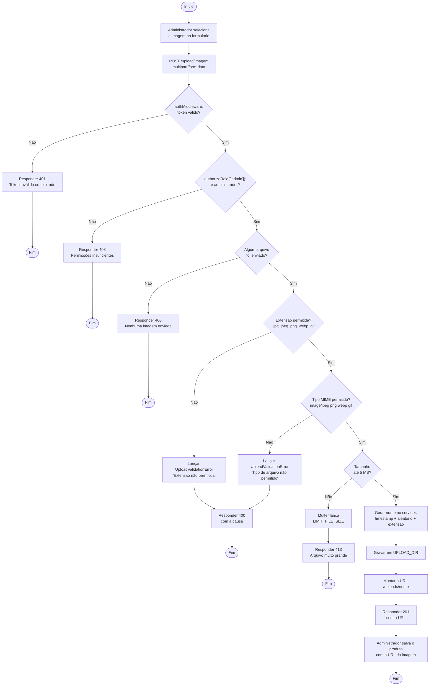

# Diagramas de atividade

Os três fluxos com mais ramificação no PC Forge: o checkout, onde a regra de negócio decide
se a compra pode acontecer; o cancelamento, que desfaz a reserva de estoque; e o upload de
imagem, onde a validação decide se o arquivo entra.

---

## Atividade 1 — Checkout do pedido

Cobre RF-04.1 a RF-04.3. Do carrinho até o pedido gravado, com as três barreiras que podem
interromper: sessão, endereço e estoque.

### Duas decisões deste fluxo

**O preço é congelado no passo `criarItens`.** Sem `preco_unitario` gravado, uma mudança
futura no valor do produto reescreveria o total de todos os pedidos antigos. Ver
[der.md](der.md).

**A baixa de estoque mora dentro da transação.** Fora dela, uma falha depois do desconto
deixaria produto reservado por um pedido que não existe. O `decrement` faz um `UPDATE`
relativo (`estoque = estoque - N`), e não uma leitura seguida de escrita, que perderia
atualizações se dois pedidos chegassem ao mesmo tempo.

---

## Atividade 2 — Cancelamento de pedido

O caminho inverso da Atividade 1: o estoque volta.

A guarda de status é o que impede devolver estoque duas vezes: um pedido já cancelado é
recusado com **409** antes de qualquer `increment`.

---

## Atividade 3 — Upload de imagem de produto

Cobre RF-03.1 a RF-03.4. Implementado em
[config/upload.ts](../TechAcademy5back/src/config/upload.ts) e coberto pela suíte
`upload.test.ts`.

### Duas decisões deste fluxo

**Extensão e MIME são checados separadamente.** Um `.exe` renomeado para `.jpg` passa na
primeira barreira e é barrado na segunda; um `.jpg` legítimo servido com MIME errado é barrado
na segunda. Checar só um dos dois deixa uma das duas portas aberta.

**O nome é gerado no servidor, nunca reaproveitado do envio.** `timestamp + aleatório` garante
que dois uploads de `foto.jpg` virem arquivos distintos, em vez de o segundo sobrescrever o
primeiro. É o que o teste de colisão verifica.

> O erro de validação é distinguido por `instanceof UploadValidationError`, nunca por
> comparação de texto da mensagem — reescrever o texto viraria um 500 silencioso.
