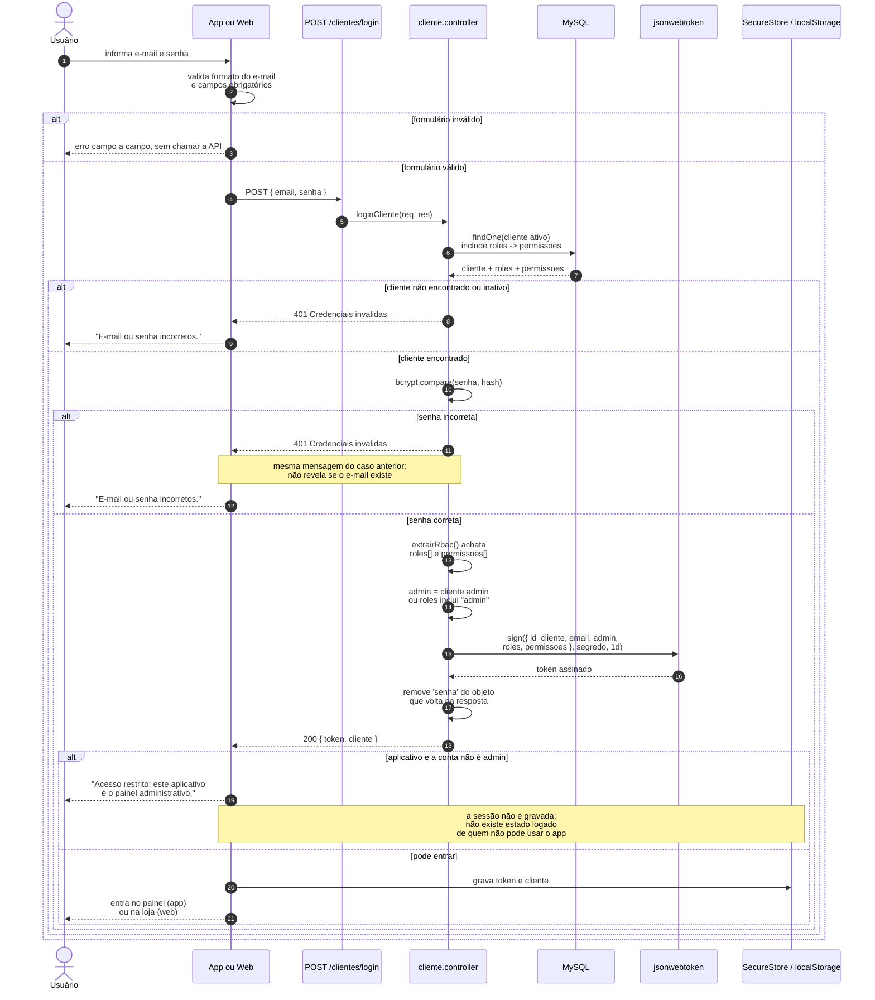
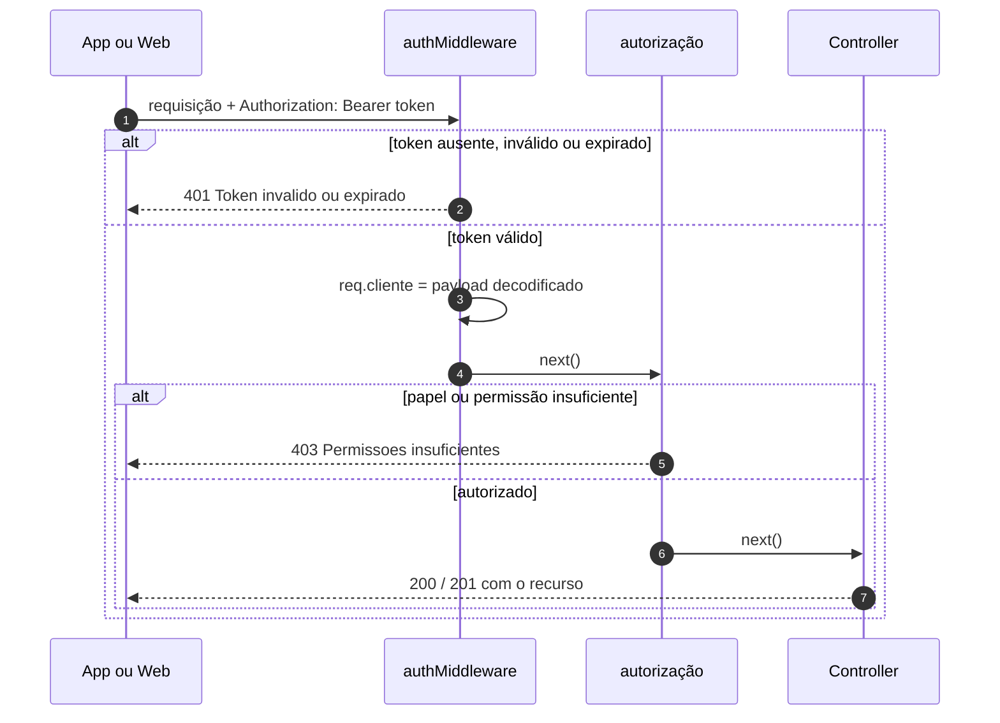
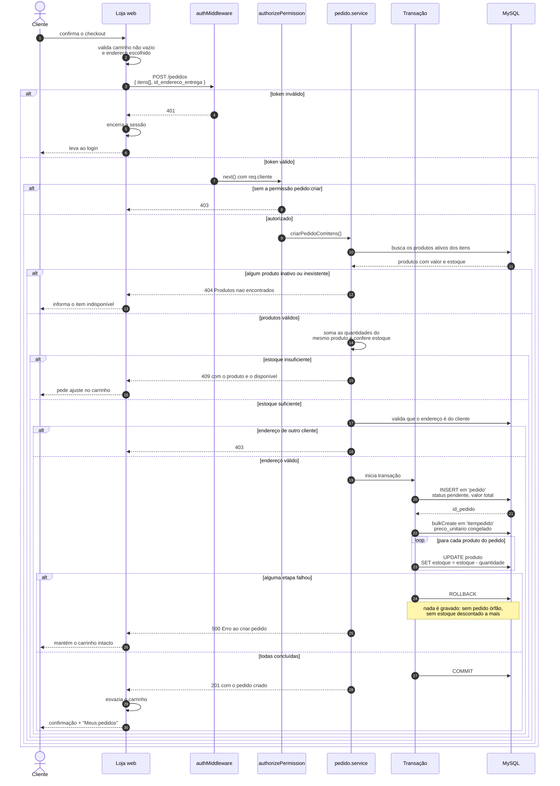
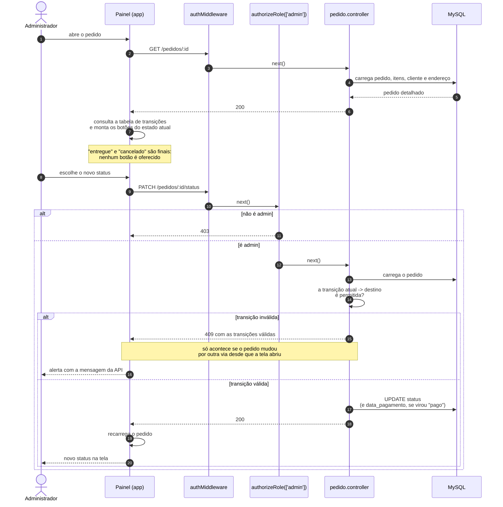

# Diagramas de sequência

As duas conversas mais importantes entre as camadas: o login, que monta o token com papéis e
permissões, e a criação de pedido, que atravessa loja, API e banco dentro de uma transação.

---

## Sequência 1 — Login com JWT e carga do RBAC

Cobre RF-01.4 e RNF-01.1 a RNF-01.4. O ponto central é o **`include` aninhado**: em uma única
consulta o Sequelize traz o cliente, seus papéis e as permissões de cada papel, e tudo isso é
achatado em duas listas de strings que viajam dentro do token.

> **O papel do cliente nasce no cadastro.** `criarCliente` vincula o novo cliente ao papel
> `cliente` em `cliente_role`, senão o token sairia com `permissoes` vazio e qualquer rota
> protegida por `authorizePermission` recusaria a compra.

### Requisição seguinte, já com o token

**A ordem é obrigatória.** `authorizeRole` e `authorizePermission` leem `req.cliente`, que só
existe depois de `authMiddleware` rodar. Invertida, encontrariam `undefined` — por isso ambos
começam com uma guarda explícita que responde 401 em vez de estourar um `TypeError` e virar
500. Ver [rbac.md](rbac.md).

---

## Sequência 2 — Criar pedido: loja web → API → MySQL

Cobre RF-04.1 a RF-04.4. A parte que importa é a **transação**: pedido, itens e baixa de
estoque acontecem juntos ou nenhum acontece.

### Por que a transação

Sem ela, quatro falhas ficam possíveis: pedido criado sem itens, itens criados sem baixa de
estoque, baixa de estoque sem pedido, ou baixa parcial quando o segundo item falha. Qualquer
uma corrompe o histórico de um jeito que nenhuma tela consegue explicar depois. O `ROLLBACK`
garante que o estoque e o carrinho continuem exatamente como estavam antes da tentativa.

---

## Sequência 3 — Admin muda o status do pedido, pelo app

Cobre RF-06.5. Mostra as duas validações da máquina de estados: a do app, que decide o que
oferecer, e a da API, que decide o que aceitar.

A tabela de transições existe nos dois lados de propósito: no app para **não oferecer** o que
seria recusado, e na API porque é ela quem **decide**. A cópia no cliente é conveniência de
interface, nunca a regra.
