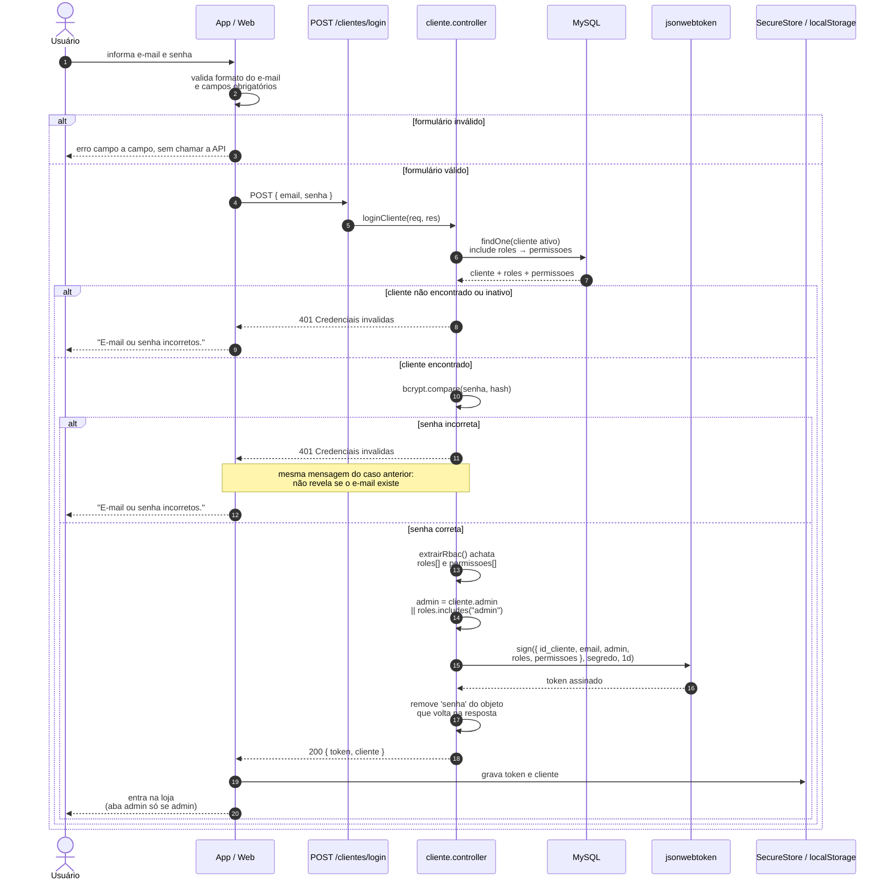
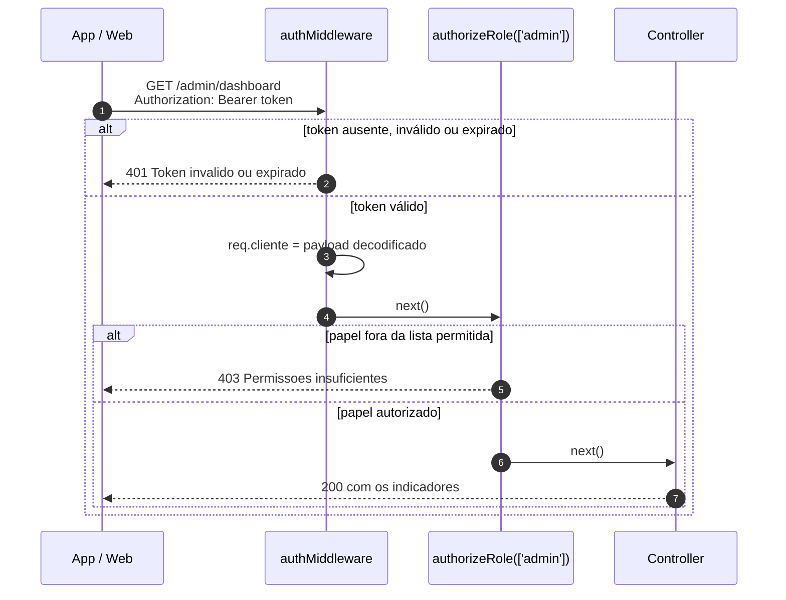
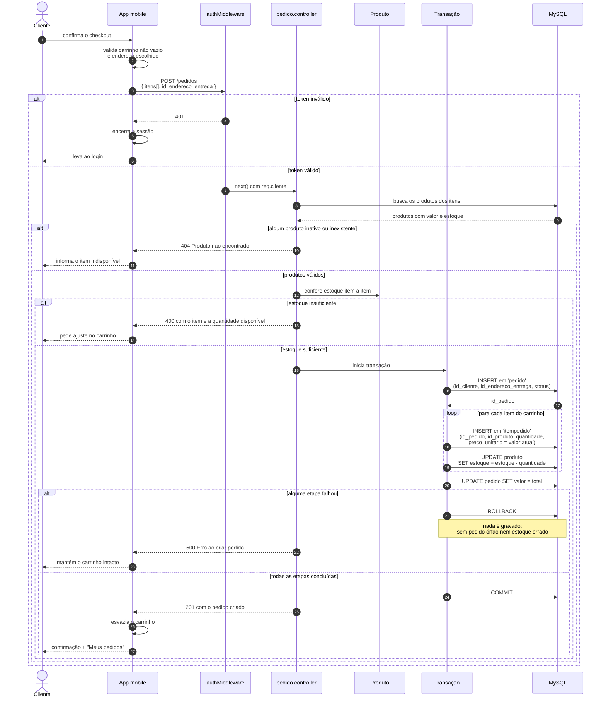

# Diagramas de sequência

As duas conversas mais importantes entre as camadas: o login, que monta o token com papéis e
permissões, e a criação de pedido, que atravessa app, API e banco dentro de uma transação.

---

## Sequência 1 — Login com JWT e carga do RBAC

Cobre RF-01.4 e RNF-01.1 a RNF-01.4. O ponto central é o **`include` aninhado**: em uma única
consulta o Sequelize traz o cliente, seus papéis e as permissões de cada papel, e tudo isso é
achatado em duas listas de strings que viajam dentro do token.

### Requisição seguinte, já com o token

**A ordem é obrigatória.** `authorizeRole` lê `req.cliente`, que só existe depois de
`authMiddleware` rodar. Invertida, ele encontraria `undefined` — por isso começa com uma
guarda explícita que responde 401 em vez de estourar um `TypeError` e virar 500. Ver
[rbac.md](rbac.md).

---

## Sequência 2 — Criar pedido: App → API → MySQL

Cobre RF-04.1 a RF-04.3. A parte que importa é a **transação**: pedido, itens e baixa de
estoque precisam acontecer juntos ou nenhum acontece.

### Por que a transação

Sem ela, três falhas ficam possíveis: pedido criado sem itens, itens criados sem baixa de
estoque, ou baixa de estoque sem pedido. Qualquer uma delas corrompe o histórico de um jeito
que nenhuma tela consegue explicar depois. O `ROLLBACK` garante que o carrinho do cliente
continue igual ao que era antes da tentativa.
