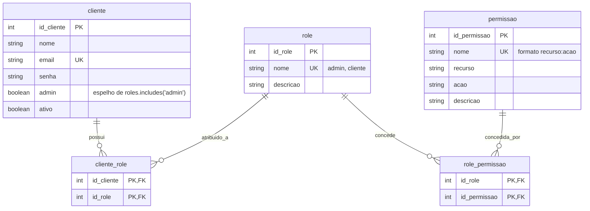
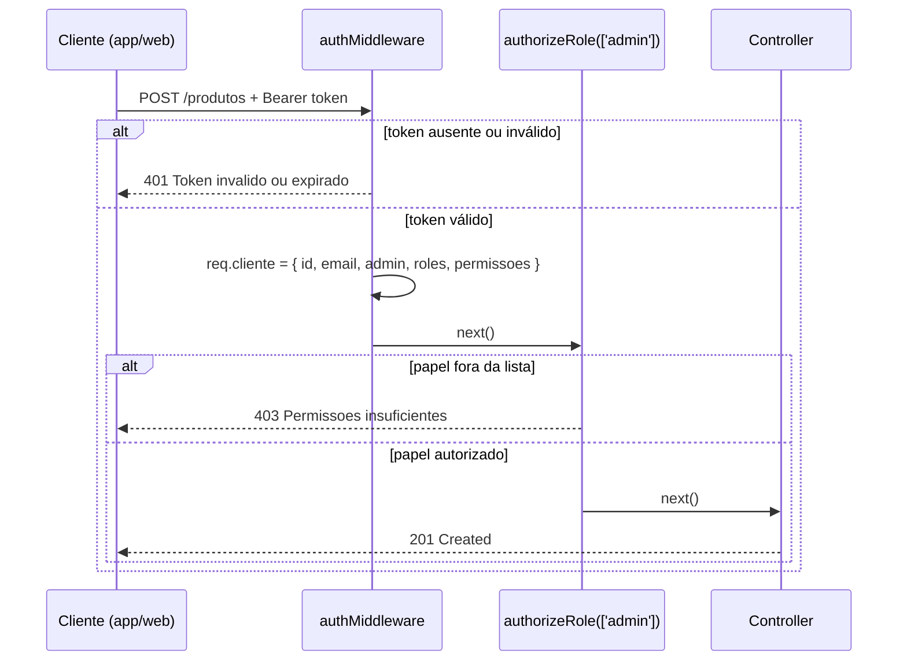

# Controle de acesso: autenticação e autorização

Como o PC Forge decide **quem é** quem chama a API (autenticação) e **o que essa pessoa
pode fazer** (autorização).

## As duas etapas

| | Autenticação | Autorização |
|---|---|---|
| Pergunta | Quem é você? | O que você pode fazer? |
| Middleware | `authMiddleware` | `authorizeRole` / `authorizePermission` |
| Entrada | Header `Authorization: Bearer <token>` | `req.cliente`, populado pela etapa anterior |
| Falha | **401** Unauthorized | **403** Forbidden |

Um token válido responde só à primeira pergunta. Um cliente logado que tenta abrir
`/admin/dashboard` está autenticado e mesmo assim precisa ser barrado — é para isso que
existe a segunda etapa.

## Modelo de dados

RBAC clássico: o cliente não recebe permissões diretamente, recebe **papéis**, e o papel é
que carrega as permissões. As duas relações são N:N, resolvidas por tabelas de junção.



As duas tabelas de junção usam **chave primária composta**: a restrição de não duplicar um
vínculo vive no banco, não apenas na lógica do seed.

Arquivos: [Role.ts](../TechAcademy5back/src/models/Role.ts),
[Permissao.ts](../TechAcademy5back/src/models/Permissao.ts),
[ClienteRole.ts](../TechAcademy5back/src/models/ClienteRole.ts),
[RolePermissao.ts](../TechAcademy5back/src/models/RolePermissao.ts). As relações `belongsToMany`
ficam em [rbac.associations.ts](../TechAcademy5back/src/models/rbac.associations.ts).

## Papéis e permissões semeados

O seed cria 22 permissões no formato `recurso:acao`, cobrindo os recursos que a API expõe:
`produto`, `categoria`, `pedido`, `cliente`, `endereco` (criar/ler/atualizar/deletar cada um),
`upload:criar` e `dashboard:ler`.

| Papel | Permissões |
|---|---|
| `admin` | todas as 22 |
| `cliente` | leitura de catálogo (`produto:ler`, `categoria:ler`), os próprios pedidos (`pedido:criar/ler/atualizar`), o CRUD completo de endereços e `cliente:ler`/`cliente:atualizar` |

## O middleware dinâmico

`adminMiddleware` era fixo — sabia checar um único papel. `authorizeRole` é uma **função de
ordem superior**: recebe a lista de papéis aceitos e devolve o middleware já configurado.
Assim cada rota declara a sua própria exigência. O `adminMiddleware` foi removido depois que
todas as rotas migraram.

```ts
export const authorizeRole =
  (rolesPermitidas: string[]) =>
  (req: Request, res: Response, next: NextFunction): void => {
    if (!req.cliente) {
      res.status(401).json({ mensagem: "Usuario nao autenticado." });
      return;
    }

    const rolesDoCliente = extrairRoles(req.cliente);

    if (!rolesDoCliente.some((role) => rolesPermitidas.includes(role))) {
      res.status(403).json({ mensagem: "Permissoes insuficientes para acessar este recurso." });
      return;
    }

    next();
  };
```

Basta **um** papel do usuário estar na lista para liberar — por isso `some`. Uma rota aberta a
mais de um cargo se escreve `authorizeRole(["admin", "editor"])`.

`authorizePermission([...])` é a variante granular, que decide pela ação em vez do cargo. Ela
exige **todas** as permissões listadas (`every`), e admin passa direto. Está em uso nas rotas
que o cliente exerce:

| Rota | Permissão exigida |
|---|---|
| `POST /pedidos` | `pedido:criar` |
| `PATCH /pedidos/:id/cancelar` | `pedido:atualizar` |
| `POST /enderecos` | `endereco:criar` |

É o que faz as tabelas `permissao` e `role_permissao` sustentarem decisão de verdade, em vez
de só existirem no modelo.

**Token legado.** Se a claim `permissoes` estiver **ausente** (`undefined`), o middleware cai
no papel, como `extrairRoles` já faz com o boolean — senão quem estivesse logado no momento do
deploy levaria 403 até o token de um dia vencer. Uma lista **vazia** é diferente: significa que
o token é novo e o usuário realmente não tem permissão alguma.

**O papel nasce no cadastro.** `criarCliente` vincula o cliente novo ao papel `cliente` em
`cliente_role`. Sem isso, só as contas do seed teriam permissões, e todo cadastro pela API
sairia com `permissoes: []` — barrado nas três rotas acima, ou seja, sem conseguir comprar. O
seed também corrige retroativamente quem já estava gravado sem papel.

## A ordem dos middlewares importa

```ts
router.post("/", authMiddleware, authorizeRole(["admin"]), ProdutoController.criarProduto);
//               1. quem é         2. pode?                 3. executa
```

1. `authMiddleware` valida o token e grava `req.cliente`
2. `authorizeRole` lê `req.cliente` e compara os papéis
3. só então o controller roda

**Invertendo a ordem**, `authorizeRole` roda antes de `req.cliente` existir. Por isso ele começa
com uma guarda explícita que responde **401** — sem ela seria um `TypeError` lendo propriedade
de `undefined`, ou seja, um 500 no lugar de um erro de autenticação. O teste 7 de
[rbac-authorize.test.ts](../TechAcademy5back/src/__tests__/rbac-authorize.test.ts) cobre
exatamente esse cenário.

## Fluxo completo



## Convivência com o boolean `admin`

A coluna `cliente.admin` continua existindo e o token continua carregando `admin`. Motivo: a web
([UsuarioContext.jsx](../TechAcademy5front/src/context/UsuarioContext.jsx)) e o app mobile
([AuthContext.tsx](../TechAcademy5mobile/src/contexts/AuthContext.tsx)) leem esse campo para
decidir se mostram a área administrativa. Migrar as três camadas de uma vez seria arriscado sem
necessidade.

No login, o campo passa a ser **derivado**: `cliente.admin || roles.includes("admin")`. E o
middleware tem o caminho inverso — `extrairRoles` deriva `["admin"]` de um token que só traz o
boolean. Isso mantém válidos os tokens emitidos antes da migração, que duram um dia.

> **Pendência:** remover o boolean quando web e mobile passarem a ler `roles`. Enquanto os dois
> existirem, os dois precisam concordar.

## Verificando na prática

Com a stack no ar e o seed rodado, as duas contas usam a senha `Senha@123`:

```bash
docker compose up -d mysql backend
docker compose exec backend npm run seed
```

| Requisição | Token | Esperado |
|---|---|---|
| `POST /produtos` | nenhum | 401 |
| `POST /produtos` | `cliente@pcforge.com` | 403 |
| `POST /produtos` | `admin@pcforge.com` | 201 |
| `GET /admin/dashboard` | `cliente@pcforge.com` | 403 |
| `GET /admin/dashboard` | `admin@pcforge.com` | 200 |

O payload do token pode ser conferido em jwt.io: o do cliente traz `roles: ["cliente"]` e
`admin: false`; o do admin, `roles: ["admin"]` e `admin: true`.
